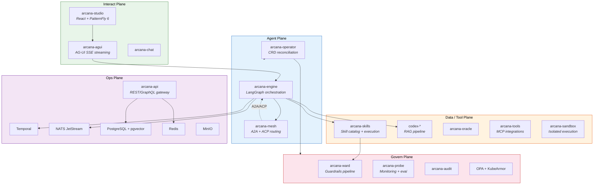

<div align="center">

# Arcana

**Kubernetes-native AI platform for building, deploying, governing, and improving AI agents and ML models.**

[](https://github.com/NP-compete/arcana/actions/workflows/ci.yaml)
[](https://opensource.org/licenses/Apache-2.0)
[](https://go.dev)
[](https://python.org)
[](#custom-resource-definitions)
[](#five-plane-architecture)

*Define agents as CRDs. Orchestrate with LangGraph. Connect with MCP, A2A, ACP, AG-UI. Govern with OPA. Scale on Kubernetes.*

[Quick Start](#quick-start) · [Architecture](#five-plane-architecture) · [Examples](#examples) · [Contributing](CONTRIBUTING.md)

</div>

---

## Why Arcana?

Building AI agents is easy. Running them in production is not.

Today, teams cobble together LangGraph for orchestration, a vector DB for RAG, a guardrail library for safety, a separate dashboard for monitoring, and a YAML-heavy deployment pipeline to glue it all onto Kubernetes. Every component has its own API, its own lifecycle, and its own failure modes.

**Arcana replaces that patchwork with a single platform**, controlled entirely through Kubernetes CRDs:

```yaml
apiVersion: arcana.io/v1alpha1
kind: ArcanaAgent
metadata:
  name: code-reviewer
spec:
  model: claude-sonnet-4-20250514
  skills: [github-pr-review, static-analysis, security-scan]
  memory:
    backend: pgvector
    ttl: 24h
  budget:
    maxTokensPerTurn: 8000
    routingStrategy: baar
  sandbox:
    runtime: gvisor
```

One `kubectl apply` and you have an agent with skills, memory, guardrails, cost controls, and sandboxed execution — reconciled by a Kubernetes operator, not a shell script.

### What makes it different

| Problem | Without Arcana | With Arcana |
|---------|---------------|-------------|
| **Agent lifecycle** | Custom scripts, manual restarts | CRD-driven reconciliation via `arcana-operator` |
| **Multi-agent routing** | Hardcoded HTTP calls between services | `arcana-mesh` with A2A + ACP protocol support |
| **Tool access** | Each agent wires its own MCP connections | Shared `ArcanaSkillRegistry` with versioning |
| **Guardrails** | Bolted-on prompt filtering, per-agent | Centralized `arcana-ward` pipeline with OPA policies |
| **Cost control** | Hope and prayer | `ArcanaBudget` CRD with token limits and alerts |
| **Evaluation** | Manual testing | `ArcanaEvalSuite` with automated quality gates |
| **Promotion** | Copy-paste YAML between clusters | `ArcanaPromotion` CRD: dev → staging → prod with approvals |
| **Multi-tenancy** | Namespace conventions | `ArcanaTenant` CRD with resource quotas and isolation |

---

## Five-Plane Architecture

Arcana separates concerns across five architectural planes. Each plane owns a distinct responsibility; together they cover the full agent lifecycle.



### Agentic Protocols

Arcana natively integrates five agentic protocols:

| Protocol | Purpose |
|----------|---------|
| **MCP** (Model Context Protocol) | Tool access — agents invoke external tools and data sources through MCP servers |
| **A2A** (Agent-to-Agent) | Agent-to-agent communication; mesh exposes agent cards and routes messages |
| **ACP** (Agent Communication Protocol) | Bridges ACP-compatible agents into the Arcana mesh |
| **AG-UI** (Agent-User Interface) | Real-time agent-to-user streaming via SSE events |
| **ACS** (Agent Control) | Lifecycle management, run cancellation, and session governance |

---

## Quick Start

### Prerequisites

- [Kind](https://kind.sigs.k8s.io/) >= 0.20
- [Docker](https://docs.docker.com/get-docker/) or [Podman](https://podman.io/) >= 4.0
- Go >= 1.23, Python >= 3.11, Node.js >= 22
- kubectl

### One-command setup

```bash
git clone https://github.com/NP-compete/arcana.git
cd arcana
make dev          # Kind cluster + backing services + build + deploy
make dev-status   # health check all services
```

Arcana auto-detects your container runtime (prefers Podman, falls back to Docker):

```bash
CONTAINER_CMD=docker make dev   # force Docker
CONTAINER_CMD=podman make dev   # force Podman
```

### Deploy your first agent

```bash
# Install CRDs
make crds-install

# Deploy a code review agent
kubectl apply -f examples/code-review-agent.yaml

# Check agent status
kubectl get arcanaagents
```

---

## Examples

See the [`examples/`](examples/) directory for ready-to-use configurations:

| Example | Description |
|---------|-------------|
| [`code-review-agent.yaml`](examples/code-review-agent.yaml) | Code review agent with GitHub PR skills and static analysis |
| [`rag-pipeline.yaml`](examples/rag-pipeline.yaml) | End-to-end RAG pipeline with document ingestion and semantic search |
| [`multi-agent-team.yaml`](examples/multi-agent-team.yaml) | Multi-agent team with A2A routing — planner, researcher, writer |
| [`budget-and-eval.yaml`](examples/budget-and-eval.yaml) | FinOps budget limits + automated evaluation suite |

---

## Custom Resource Definitions

Arcana ships 16 CRDs that cover the full agent lifecycle:

### Core

| CRD | Short Name | Scope | Purpose |
|-----|-----------|-------|---------|
| `ArcanaAgent` | `aag` | Namespaced | Agent lifecycle and configuration — model, skills, memory, guardrails |
| `ArcanaTenant` | `aten` | Cluster | Multi-tenant isolation — namespace mapping and resource quotas |
| `ArcanaModel` | `amod` | Namespaced | Model registry — provider, version, and routing configuration |

### Skills & Data

| CRD | Short Name | Scope | Purpose |
|-----|-----------|-------|---------|
| `ArcanaSkillRegistry` | `askr` | Namespaced | Skill catalog and versioning |
| `ArcanaConnector` | `acon` | Namespaced | External data source connections |
| `ArcanaCodex` | `acdx` | Namespaced | RAG knowledge base configuration |
| `ArcanaDataset` | `adset` | Namespaced | Training and evaluation dataset management |

### Governance

| CRD | Short Name | Scope | Purpose |
|-----|-----------|-------|---------|
| `ArcanaRole` | `arole` | Namespaced | RBAC + ABAC policies for agents, skills, and resources |
| `ArcanaGuardrail` | `agrd` | Namespaced | Input/output filtering rules and safety constraints |
| `ArcanaBudget` | `abud` | Namespaced | FinOps token and compute spend limits with alert thresholds |

### Operations

| CRD | Short Name | Scope | Purpose |
|-----|-----------|-------|---------|
| `ArcanaEvalSuite` | `aes` | Namespaced | Automated evaluation pipelines — advisory/warn/block quality gates |
| `ArcanaExperiment` | `aexp` | Namespaced | A/B testing and canary experiments for agent configurations |
| `ArcanaPromotion` | `aprom` | Namespaced | Environment promotion — dev → staging → prod with approval gates |
| `ArcanaBlueprint` | `abp` | Namespaced | Reusable agent templates |
| `ArcanaBackupPolicy` | `abkp` | Namespaced | Cron-based backups with retention and destinations |
| `ArcanaPlatform` | `aplat` | Cluster | Platform-wide configuration and defaults |

---

## How it compares

| Capability | Arcana | kagent | LangGraph Platform | Hugging Face Agents |
|-----------|--------|--------|-------------------|---------------------|
| **K8s-native CRDs** | 16 CRDs, full operator | CRDs for agents + tools | Helm chart, not CRD-driven | No K8s support |
| **Multi-agent routing** | A2A + ACP mesh | A2A support | Supervisor pattern | Sequential only |
| **Protocol support** | MCP, A2A, ACP, AG-UI, ACS | MCP, A2A | MCP (partial) | MCP (partial) |
| **Guardrails** | OPA + KubeArmor + Ward pipeline | No built-in | No built-in | No built-in |
| **FinOps / cost control** | ArcanaBudget CRD with alerts | No built-in | Usage tracking | No built-in |
| **Evaluation** | ArcanaEvalSuite with quality gates | No built-in | LangSmith (separate product) | No built-in |
| **Sandboxed execution** | gVisor / Kata per agent | No built-in | No built-in | No built-in |
| **Multi-tenancy** | ArcanaTenant CRD | Namespace-based | Not supported | Not applicable |
| **Environment promotion** | ArcanaPromotion: dev→staging→prod | No built-in | No built-in | Not applicable |

---

## Repository Structure

```
arcana/
├── cmd/                    # 19 Go service entrypoints
│   ├── engine/             # Agent orchestration engine (LangGraph)
│   ├── operator/           # Kubernetes operator (CRD controller)
│   ├── mesh/               # A2A + ACP mesh gateway
│   ├── api/                # REST/GraphQL API gateway
│   ├── agui/               # AG-UI protocol server (SSE)
│   ├── codex-*/            # RAG pipeline services
│   └── ...
├── pkg/                    # Shared Go packages (mcp, a2a, acp, crds)
├── services/               # Non-Go services
│   ├── skills/             # Skill engine (Python/FastAPI)
│   ├── ward/               # Guardrails pipeline (Python/FastAPI)
│   ├── forge/              # Model fine-tuning service (Python)
│   ├── memory/             # Agent memory service (Python)
│   ├── studio/             # Web UI (React + PatternFly 6)
│   └── ...
├── deploy/
│   ├── crds/               # 16 CRD manifests
│   ├── helm/               # One Helm chart per service
│   ├── compose/            # Backing service Compose file
│   └── kind/               # Kind cluster config
├── examples/               # Ready-to-use agent configurations
├── docs/                   # Architecture, deployment, security docs
├── e2e/                    # Playwright end-to-end tests
├── .github/                # CI/CD workflows (build, release, security)
├── Makefile                # 25+ build/dev/test targets
└── go.work                 # Go workspace (31 modules)
```

## Make Targets

| Target | Description |
|--------|-------------|
| `make dev` | Full dev env (Kind + compose + build + deploy) |
| `make dev-down` | Tear down dev env |
| `make dev-status` | Health check all services |
| `make build` | Build all services |
| `make test` | Run all tests (Go + Python + TypeScript) |
| `make lint` | Lint all code |
| `make crds-install` | Install CRDs into cluster |
| `make docker-build` | Build container images |

---

## Contributing

See [CONTRIBUTING.md](CONTRIBUTING.md) for branch naming, commit conventions, and PR workflow.

Check the [issues](https://github.com/NP-compete/arcana/issues) for `good-first-issue` and `help-wanted` labels.

## Security

See [SECURITY.md](SECURITY.md) for vulnerability disclosure policy.

## License

Apache 2.0 — see [LICENSE](LICENSE) for details.
